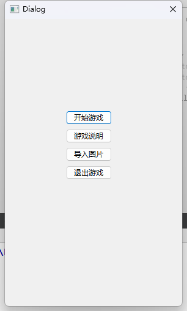
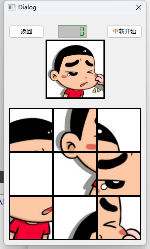
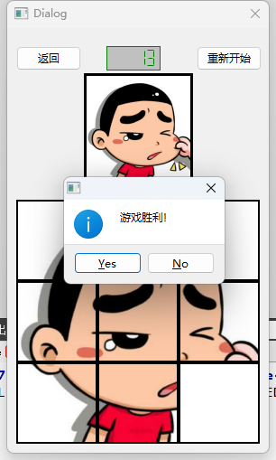

# QT-拼图游戏

## 环境

QtCreator、C++11

## 开发过程

技术上没啥特别的。

导入图片，分为9块。

用一个map存储“图片块”，初始化按位置顺序编号。

点击“开始游戏”打乱9张图片的位置，按照编号重新显示相应的图片。

每移动一次就遍历map有没有恢复顺序。

循环，直至复位。

源码：[nanoahSR/Qt-Puzzle-Game: 使用Qt做的简单拼图游戏，玩法类似于【华容道】 (github.com)](https://github.com/nanoahSR/Qt-Puzzle-Game)

## 游戏截图

主界面



游戏界面



游戏胜利



# pintu

【Qt】——简单拼图

```
（2021.7.26）
版本：拼图2.0
作者：orall
时间：2021.7.26
完善了：解决没法拼回原图的情况（bug在map[y][x]这里,y是在前面！）
```

```
(2021.7.22)
版本：拼图1.0
作者：orall
时间：2021.7.22
版本特点：基本实现了GUI的拼图
待完善：1.后续可以完成4*4，5*5
			  2.存在没法拼回原图的情况
```
